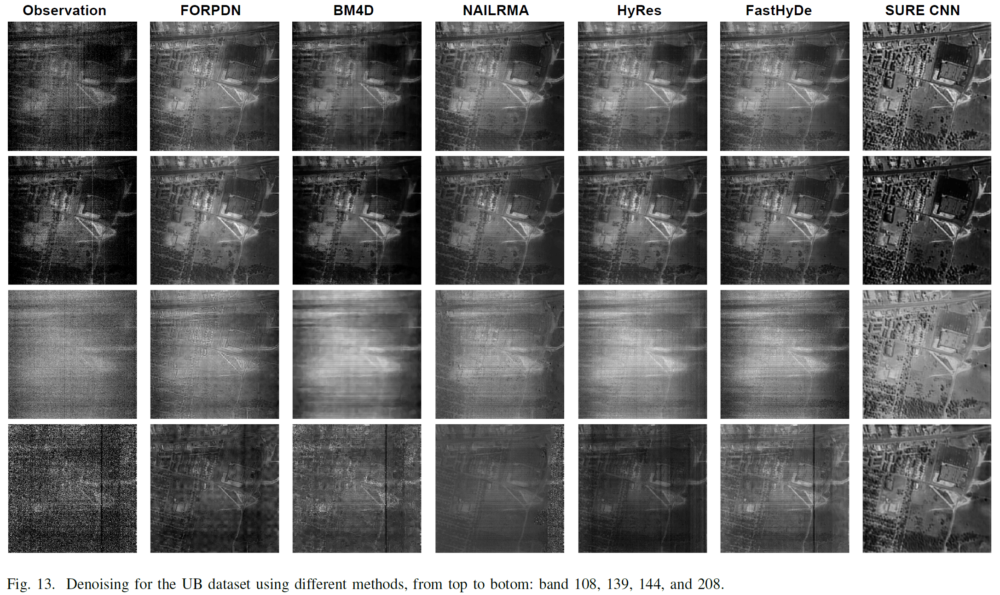

# SURE-CNN
 Official codes for the paper "SURE based Convolutional Neural Networks for Hyperspectral Image Denoising", publised in *IEEE Transaction on Geoscience and Remote Sensing (TGRS)*, vol. 59(4), 2020, pp. 3369-3382. 
 **Authors:** Han V. Nguyen $^\ast \dagger$, Magnus O. Ulfarsson $^\ast$ and  Johannes R. Sveinsson $^\ast$  
$^\ast$ Faculty of Electrical and Computer Engineering, University of Iceland, Reykjavik, Iceland 
$^\dagger$ Department of Electrical and Electronic Engineering, Nha Trang University, Khanh Hoa, Vietnam 
Email: hvn2@hi.is 

## Abstract  
This paper addresses the hyperspectral image (HSI) denoising problem by using Stein's unbiased risk estimate (SURE) based convolutional neural network (CNN). Conventional deep learning denoising approaches often use supervised methods that minimize a mean-squared error (MSE) by training on noisy-clean image pairs. In contrast, our proposed CNN-based denoiser is unsupervised and only makes use of noisy images. The method uses SURE, which is an unbiased estimator of the MSE, that does not require any information about the clean image. Therefore minimization of the SURE loss function can accurately estimate the clean image only from noisy observation. Experimental results on both simulated and real hyperspectral datasets show that our proposed method outperforms competitive HSI denoising methods.

**Please cite our work if you are interested**

 @article{nguyen2020hyperspectral,
  title={Hyperspectral Image Denoising Using SURE-Based Unsupervised Convolutional Neural Networks},
  author={Nguyen, Han V and Ulfarsson, Magnus O and Sveinsson, Johannes R},
  journal={IEEE Transactions on Geoscience and Remote Sensing},
  volume={59},
  number={4},
  pages={3369--3382},
  year={2020},
  publisher={IEEE}
}

@inproceedings{nguyen2020sure,
  title={Sure based convolutional neural networks for hyperspectral image denoising},
  author={Nguyen, Han V and Ulfarsson, Magnus O and Sveinsson, Johannes R},
  booktitle={Proc. IEEE Geosci. Remote Sens. Symp},
  year={2020}
}
## Usage: 
Run the jupyter notebook file and see the results. 
The folders contains: 
 - Data (preprocessing in Matlab) are stored in folder *hsi_data/Demo*
     + The data are the simulated noisy PU dataset with $\sigma=50/255$ (Case 1),
     + Because of the limitation of the github space, if you need more data, please contact us.
 - CNN models are stored in folder *models*
 - Some helped functions are stored in the folder *utils*
## Enviroment: 
- Tensorflow 2.0 or higher
- Numpy
- Matplotlib
- Scipy, Skimage
## Results
- **Simulated dataset**

- **Real dataset**

